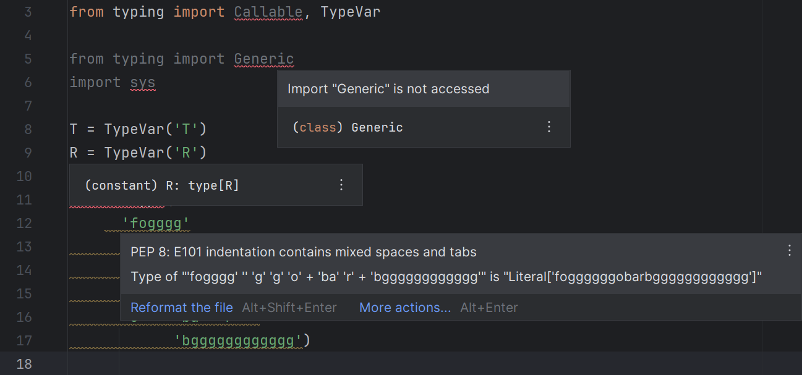

# Pyright Language Server for PyCharm Professional

[][5]
[][5]
[][5]

<!-- Plugin description -->
Pyright language server integration for PyCharm Professional.

This plugin acts as a bridge between [the Pyright language server][1]
and [the experimental LSP API][2] added in PyCharm Professional 2023.2
to give you annotations about your code as you edit your Python files.

Note: If you use PyCharm Community,
install [the <i>Pyright</i> plugin][3] instead.

## Usage

Go to <b>Settings</b> | <b>Tools</b> |
<b>Pyright LS (Global)</b> / <b>Pyright LS (Project)</b> and
set the path to your Pyright language server executable.
It is typically named `pyright-langserver`/`pyright-python-langserver`.

(Not sure what this means? See [the docs][4] for more information.)

You might need to reopen your files or restart the IDE
for the files to be recognized by the language server.

  [1]: https://github.com/microsoft/pyright
  [2]: https://plugins.jetbrains.com/docs/intellij/language-server-protocol.html
  [3]: https://github.com/InSyncWithFoo/pyright-for-pycharm
  [4]: https://insyncwithfoo.github.io/pyright-for-pycharm/configurations/common/#executable
<!-- Plugin description end -->

## Installation

This plugin [is available][5] on the Marketplace.
You can also download the ZIP files manually from [the <i>Releases</i> tab][6]
or [the <i>Actions</i> tab][7] and follow the instructions described [here][8].

Currently supported versions:
2024.1 (build 241.14494.241) - 2024.1.* (build 241.*).

## Credits

Most of the code is derived from [@koxudaxi/ruff-pycharm-plugin][9].
It is such a fortune that that plugin does almost the same thing
and is also written in Kotlin, and hence easily understandable.

The SVG and PNG logos are derived from [the README image][10]
of the [@microsoft/pyright][1] repository,
generated using Inkscape's autotrace feature.

Some other files are based on or copied directly from
[@JetBrains/intellij-platform-plugin-template][11].

  [5]: https://plugins.jetbrains.com/plugin/24146
  [6]: https://github.com/InSyncWithFoo/pyright-langserver-for-pycharm/releases
  [7]: https://github.com/InSyncWithFoo/pyright-langserver-for-pycharm/actions/workflows/build.yaml
  [8]: https://www.jetbrains.com/help/pycharm/managing-plugins.html#install_plugin_from_disk
  [9]: https://github.com/koxudaxi/ruff-pycharm-plugin
  [10]: https://github.com/microsoft/pyright/blob/main/docs/img/PyrightLarge.png
  [11]: https://github.com/JetBrains/intellij-platform-plugin-template
